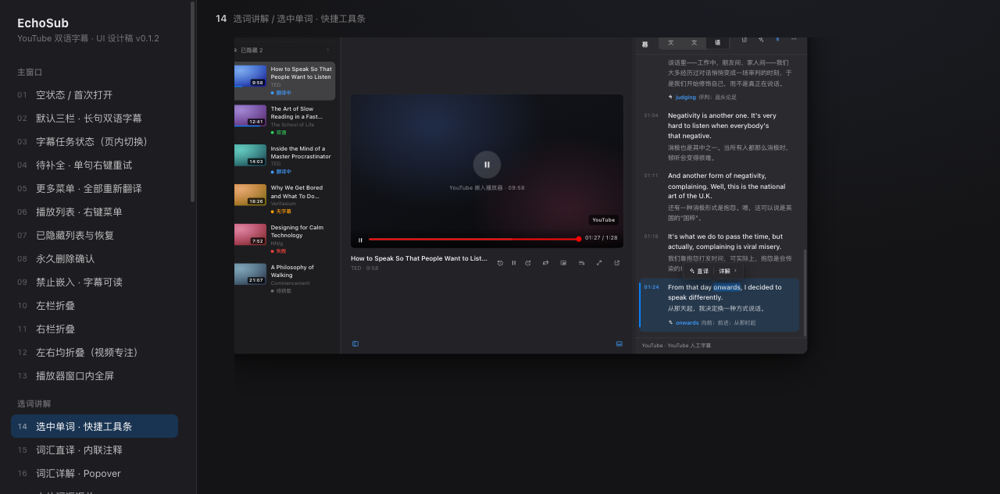
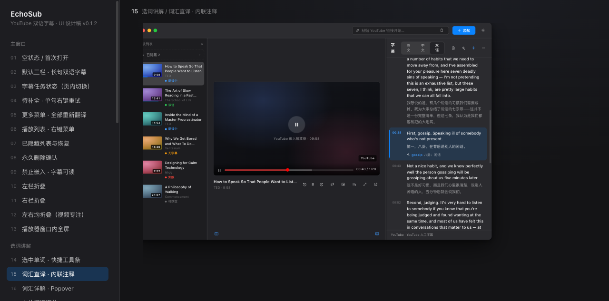
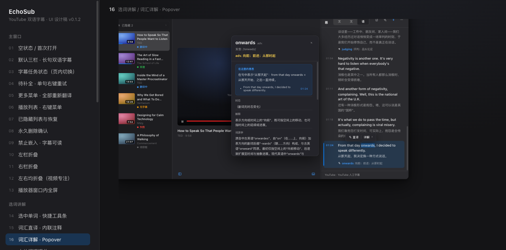
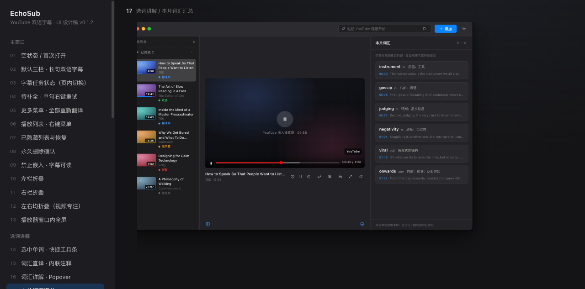
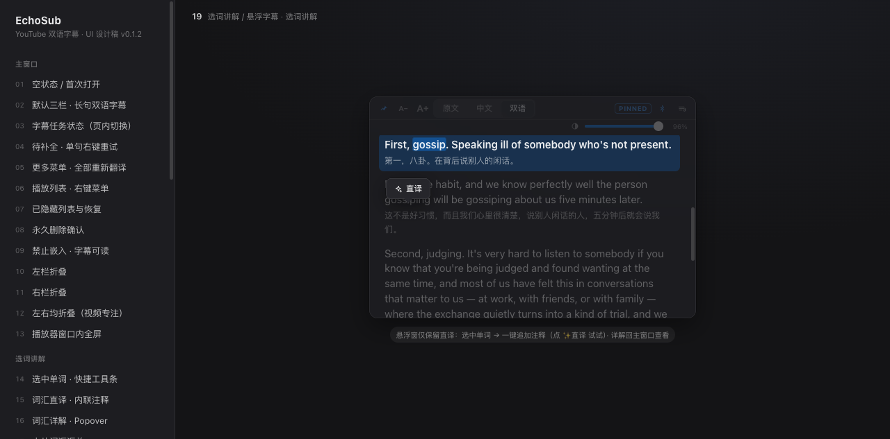
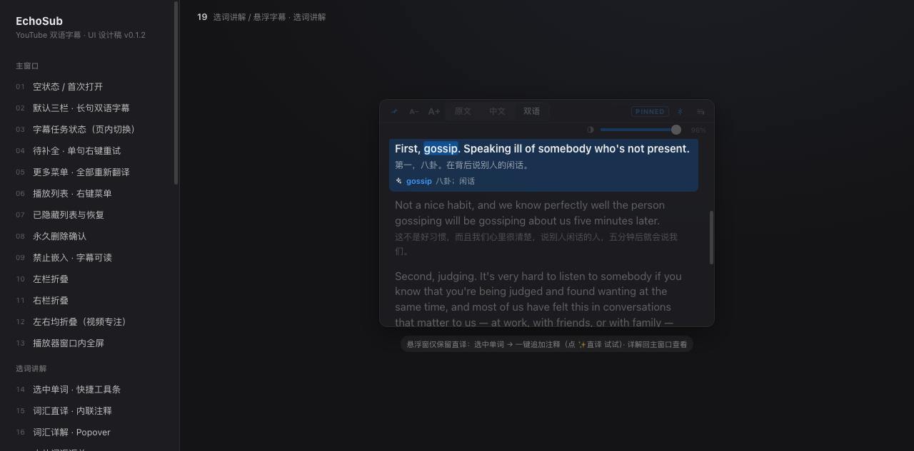
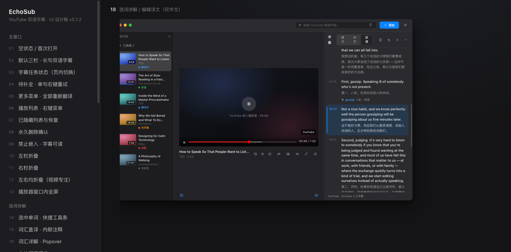

# EchoSub 选词讲解与译文编辑｜功能交接文档

> 版本：v1.0（待开发评审）
> 原型：`youtube-player/`（本地预览 `http://localhost:4311/index.html`，左栏「选词讲解」分组，画面 14–19）
> 关联文档：`EchoSub-v0.1.2-UI-implementation-handoff.zh-CN.md`
> 状态：交互与视觉已与产品确认，进入开发排期

## 1. 功能概述

### 1.1 要解决的问题

整句翻译解决"看懂这句"，但阻碍理解的往往只是句中个别单词或短语。用户当前的替代路径（切出去查词典）会打断观看和跟读节奏。

### 1.2 方案一句话

在英文字幕上选中单词/短语即可唤起 AI 讲解：**直译**以注释形式就地追加到该句中文翻译之后（下次看到这句时障碍词已被标记）；**详解**以 Popover 卡片提供音标、语境义、词源、记忆法等完整内容。

### 1.3 本期范围

| 包含 | 不包含 |
| --- | --- |
| 字幕面板选词（直译 + 详解） | 生词本、背词计划（后续版本评估） |
| 本片词汇汇总入口 | 桌面歌词内选词（瞬态层，不适合停留操作） |
| 悬浮字幕窗选词（**仅直译**） | 词典发音 TTS（预留，不阻塞） |
| 手动编辑译文（仅中文） | 英文原文编辑（原字幕只读） |

### 1.4 已确认的关键产品决策

1. 详解载体为 **Popover 锚定卡片**（方案 A），不用背景卡同款侧栏。
2. 提供**"本片词汇"**轻量汇总入口；不做任何跨视频的生词收集视图。
3. 悬浮字幕窗**只保留直译**，不在小窗内打开详解卡片（470 宽窗口 + 348 卡片过于拥挤，且与悬浮窗"悬停淡出、Pin 置顶"的窗口行为冲突）。
4. 直译**全局默认显示，不设开关**。
5. 编辑译文**只针对中文翻译文本**，英文原字幕永远只读。

## 2. 交互流程总览

```text
拖选英文单词/短语（选区自动吸附到单词边界）
   → 选区上方浮出工具条
   ├─ ✨ 直译 → AI 生成语境义 → 内联追加到该句中文之后（字幕面板 / 悬浮窗同步）
   └─ 详解   → 打开 Popover 卡片（仅主窗口）
                 └─ 点同根词/近义词 → 卡片内链式查词（可返回）
                 └─ 点"本句"       → 视频跳回该句重播

字幕面板头部 [本片词汇 N] → 汇总浮层 → 点词看详解 / 点句跳时间
字幕行右键 → 编辑译文 → 行内编辑中文 → ⌘Enter 保存（标记"已编辑"）
```

播放不中断：查词、生成、追加注释全程不暂停视频。

## 3. 触发与选词（画面 14）



- **可选区域**：仅英文字幕文本；中文字幕选区不出现工具条（查的是生词，不是译文）。
- **选区吸附**：用户选中半个词时自动补全到单词边界；跨词短语尊重用户选区；跨字幕行的选区不触发。
- **工具条**：PopClip 式浮动小条，位于选区上方居中，含两个按钮：
  - `✨ 直译`：追加内联注释（见 §4）
  - `详解 ▸`：打开 Popover（见 §5）
- **其他入口**：
  - 双击英文单词 = 直接直译（零成本手势，无工具条）；
  - 字幕行右键菜单追加「讲解选词」（有选区时可用）；
  - 快捷键：⌘E 直译、⌘⇧E 详解（作用于当前选区）。
- **与既有规则的关系**：沿用"选中文字不触发视频跳转"，拖选过程中不 seek；点击工具条不 seek。
- 触发范围：右侧字幕面板（完整）、悬浮字幕窗（仅直译，见 §7）。

## 4. 词汇直译 · 内联注释（画面 15）



直译结果**就地追加到该字幕单元的中文翻译之后**，是第三阅读层级（英文 > 中文 > 词汇注释）：

```text
00:38  First, gossip. Speaking ill of somebody who's not present.
       第一，八卦。在背后说别人的闲话。
       ✨ gossip · 八卦；闲话 ┆ ill · 恶劣的；不怀好意的
```

规格：

- **格式**：`✨ 词 · 语境义`，词用强调色（深色下 `#409cff`）、释义用次级文字色；同句多条按查询顺序排列，细分隔符 `┆` 分隔，自动换行。
- **内容取值**：优先取"在这句里的意思"（语境义），而不是词典第一释义。
- **持久化**：按字幕单元 ID 挂载，重启后仍在；悬浮字幕窗与字幕面板显示同一份数据。
- **可管理**：hover 某条出现 `×` 可移除（仅移除注释，不影响字幕）；点击某条 → 打开该词的详解 Popover（直译与详解形成闭环）。
- **幂等**：同一句重复查同一个词，静默更新释义，不追加重复条目。
- **加载/失败**：触发后该位置显示 shimmer；失败只影响这一条，原地提供重试，不进入任何全局错误态。
- **无开关**：全局默认显示，不提供隐藏设置（已确认）。

## 5. 词汇详解 · Popover（画面 16）



- **载体**：348pt 宽 Popover，锚定在选中词所在行，**向字幕面板左侧展开**（盖住播放器一侧而非字幕一侧），保持被查询的句子始终可见；Esc 或点击外部关闭。
- **卡片结构**（自上而下）：

| 区块 | 内容 |
| --- | --- |
| 词头 | 单词、词性、发音（音标）、词性释义（强调色） |
| **在这里的意思** | 语境义 1–2 句（最高优先级，视觉上是唯一带底色的区块）；下方附"本句"行，点击跳回该句重播 |
| 时态/形态 | 词形变化说明 |
| 解释 | 通用含义 1–2 句 |
| 词源学 | 构词与源流 |
| 记忆方法 | 拆解联想 |
| 同根词 | 胶囊 chip，**可点击链式查词**（卡片内切换，带返回） |
| 近义词 / 反义词 | 胶囊 chip，同样可链式查词 |
| 常用短语 | 编号列表，附中译 |
| 例句 | 第一条为**当前字幕本句**（带时间戳，可重播），其后为 AI 补充例句（附中译） |

- **短语触发**：选中多词时模板自动简化——跳过词源/时态，重心放在整体含义与搭配。
- **加载/失败**：卡片先出骨架（ shimmer 分区），失败显示错误条 + 重试，不影响字幕面板。
- 内容超长时卡片内滚动，最大高度约 480pt。

## 6. 本片词汇汇总（画面 17）



- **入口**：字幕面板头部新增按钮「本片词汇 N」（N 为本视频已查词数），与"背景卡"按钮同排；打开为覆盖字幕面板的浮层（与背景卡同范式，淡入淡出）。
- **列表项**：单词 + 词性 + 直译；下方一行出处（时间戳 + 英文原句，单行省略）。
- **交互**：点单词 → 详解 Popover；点出处行 → 视频跳转到该句时间。
- **定位说明**：这是"直译痕迹"的自然汇总，不是生词本；不提供收藏、标记掌握、跨视频聚合等能力。

## 7. 悬浮字幕窗 · 仅直译（画面 19 / 19b）




- 悬浮窗选中英文单词后，工具条**只有一个按钮：`✨ 直译`**。
- 点击后注释直接追加到悬浮窗内该句中文下方（与字幕面板同一份数据、同一视觉规则），可 `×` 移除。
- **不在悬浮窗内打开详解卡片**；需要详解时用户回主窗口（已确认，原 Popover 方案废弃）。
- 悬浮窗字号跟随其 A−/A+ 设置，注释按中文规则自动小 3pt。

## 8. 编辑译文（画面 18）



- **入口**：字幕行右键菜单新增「编辑译文」（位于"补翻/重翻此句"之下）。
- **编辑态**：该行的中文位置变为行内 textarea（预填当前译文、自动全选聚焦）；`⌘Enter` 保存、`Esc` 取消，另有 保存/取消 按钮；英文原文始终只读。
- **保存后**：显示用户修订文本，并在中文行尾标注小徽章「已编辑」；持久化保存，重启后仍在。
- **数据语义**：用户修订是**覆盖层**——AI 原译文保留，"重新翻译此句 / 全部重新翻译"会清除该句修订（重翻确认文案需补充此提示）。
- 缺译（待补全）的行同样可以先手动补译，此时该句视为"已由用户补全"，不再计入"待补全 N 句"。

## 9. AI 调用语义

- **服务**：复用现有翻译服务（OpenAI 兼容接口），无需新增配置；走相同的 Key、超时与诊断日志通道。
- **上下文**：请求携带 当前字幕单元 + 前后邻句 + 视频背景卡（如已生成）。短语和语境强相关的词必须优先输出语境义。
- **直译**：输出极短结果（词 + 词性 + 语境义，分号分隔多义），供内联显示；不开思考模式。
- **详解**：输出结构化 JSON（词头/音标/语境义/形态/解释/词源/记忆法/同根/近反义/短语/例句），可开思考模式；例句第一条必须为当前字幕原句。
- **缓存**：详解按（词/短语小写规范化 + 视频 ID + 句 ID）缓存；同一词在同视频不同句中可因语境不同分别缓存。
- **并发**：查词任务独立于翻译批次队列，不阻塞、不互相取消。

## 10. 数据模型建议

```text
SubtitleUnit（既有）
├─ id / start / end / en / zh          ← 既有
├─ zhUserOverride?: string             ← 新增：用户修订译文（覆盖层）
└─ glosses: GlossEntry[]               ← 新增：内联直译，按字幕单元挂载

GlossEntry
├─ id / surface（原文词形）/ normalized（规范化词形）
├─ gloss（语境义）/ pos / createdAt
└─ detailCacheKey → VocabDetail

VocabDetail（按 normalized + videoID + subtitleID 缓存）
└─ phonetic / contextual / forms / explanation / etymology /
   memory / cognates[] / synonyms[] / antonyms[] / phrases[] / examples[]
```

存储位置与现有字幕/翻译缓存一致（`~/Library/Application Support/EchoSub/`）；删除视频时随该视频的字幕、翻译、背景卡一并清除（删除确认 sheet 的清单需追加"词汇注释与详解缓存"）。

## 11. 状态与边界

| 情况 | 行为 |
| --- | --- |
| 直译生成中 | 注释位置 shimmer，不阻塞播放与其他行 |
| 单条直译失败 | 原地"生成失败 · 重试"，仅影响该条 |
| 详解生成中 | Popover 内分区骨架；可正常关闭，结果到达后写入缓存 |
| 详解失败 | 卡片内错误条 + 重试；不影响已存在的直译 |
| 同词重复查 | 直译静默更新；详解直接命中缓存秒开 |
| 选区跨字幕行 | 不触发工具条 |
| 中文选区 | 不触发工具条 |
| 无翻译服务配置 | 工具条可用，触发后引导至设置翻译服务页（与字幕翻译同一引导） |
| 桌面歌词 | 不支持选词（瞬态层，无操作入口） |

## 12. 验收标准

- 选中英文单词出现工具条，选中中文或跨行不出现；拖选不触发视频跳转。
- 直译追加在该句中文之后，格式为"词 · 语境义"，同句多条不重复；重启后仍在。
- 点击直译条目打开详解；详解 Popover 不遮挡被查询的句子，Esc/点外部可关。
- 详解首屏包含语境义与本句（可点重播）；同根/近义词可链式查词。
- 悬浮窗只能直译、打不开详解；悬浮窗与字幕面板注释一致。
- 本片词汇的计数与实际注释一致；点出处行能跳到正确时间。
- 编辑译文只改中文；保存后显示"已编辑"并持久化；重翻该句后修订被清除。
- 全程不暂停视频；任何单点失败不破坏已有字幕与注释。

## 13. 原型画面索引

| 编号 | 画面 | 对应章节 | 截图 |
| --- | --- | --- | --- |
| 14 | 选中单词 · 快捷工具条 | §3 | `images/vocab/14-selection-toolbar.png` |
| 15 | 词汇直译 · 内联注释 | §4 | `images/vocab/15-inline-gloss.png` |
| 16 | 词汇详解 · Popover | §5 | `images/vocab/16-vocab-popover.png` |
| 17 | 本片词汇汇总 | §6 | `images/vocab/17-video-vocab.png` |
| 18 | 编辑译文（仅中文） | §8 | `images/vocab/18-edit-translation.png` |
| 19 / 19b | 悬浮字幕 · 选词与直译追加 | §7 | `images/vocab/19-floating-lookup.png`、`19b-floating-gloss-added.png` |

原型为可交互 HTML（`youtube-player/`），演示数据为 TED 演讲字幕；词汇详解内容（onwards）为真实期望输出的样例，开发时可对照 §5 表格逐字段验收。
